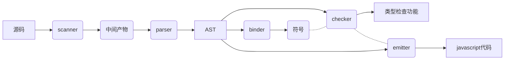
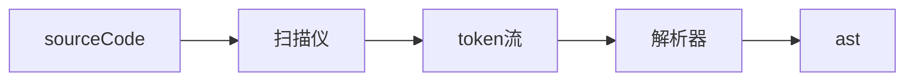
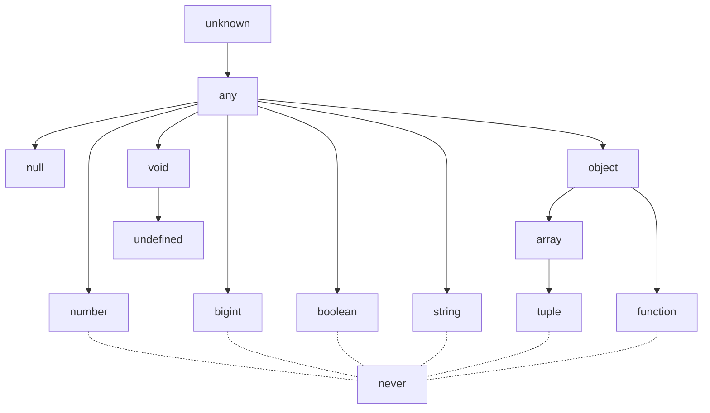

## TS相关

### 基本概念

类型注解：ts里的类型注解是一种轻量级的为函数或变量添加约束的方式

### 基础类型

布尔值、数字、字符串、数组、元组、枚举、any、void、null、undefined、never、object

### any、unknown、never、void

#### 定义

- any：任意类型的变量
- unknown：表示未知类型
- never：永不存在的值的类型
- void：无任何类型，没有类型

> unknown与any类似，但使用前必须进行断言或守卫，从类型推导来讲，unknown是最高级类型，any是unknown的下一级

> nerver、void用于函数时，never表示函数用于执行不到返回值那一步(抛出异常或死循环)的返回值类型，即用不存在的值的类型，而void则表示没有返回值，不返回或返回undefined。从类型推导来讲，never是最低层，void与any同级

#### 使用

- 能不使用any就不用
- 声明时如果不确定具体的类型，则可以使用unknown代替，在使用时用类型断言或类型守卫进行类型收缩
- never常用于构造条件类型来组合出更灵活的类型定义
- void常用于表示类型没有返回值

### 扩展

#### any与unknown

在原先的typescript中，any属于top type(最高级类型)，在typescript3.0中，unknown才是top type

如果不缩小类型，就无法对unknown类型执行任何操作

```ts
function getDog() {
  return '22'
}
cosnt dog: unknown = getDog()
dog.hello() // Object is of type 'unknown'
```


### ts高级用法

- 接口(interface)可以描述一个对象或者函数
- 类(class)
- 函数
- 泛型
- 枚举
- 迭代器和生成器
- 装饰器
- 继承、多态、重载、重写
- 抽象类&抽象方法

具体使用示例可以看[官网](https://www.tslang.cn/docs/handbook/interfaces.html)

### TS编译原理



**实线为主流程，有三条，虚线为独立流程，符号单独指向了检查器，检查器单独指向了发射器**

总的来说是



token流和ast类似，是扫描之后转换代码的一个中间产物，也是一个对象，不过key和value不一样，但是总体构成是类似的

### 类型推论图




### 面试题

- 以下代码ts推论出来的类型是什么

```ts
let a = 1024 // number
let b = '1024' // string
const c = 'apple' // null，const类型推论出来的都是null
let d = [true, false, true] // array，准确来说是boolean[]
let e = {name: 'apple'} // object
let f = null // null
```

- 可赋值性

子集可以赋值给超集，超集不能赋值给子集，除非做出断言

```ts
function a(input: string): string {
  return input
}
function b(iniput: string | number) {
  return input
}
// a可以直接赋值给b
let input = a()
b(input)
// 断言方法1：as关键字
let input = b()
a(input as string)
// 断言方法2：通过泛型固定参数类型
a(<string>input)
```

### type与interface异同

在官方文档里，描述type的作用是为类型起**别名**，interface则是侧重描述数据结构的(比如一个对象里包含了什么属性)

#### 用法

- type

```ts
type age = number
type dataType = number | string
type method = 'GET' | 'POST' | 'PUT' | 'DELETE'
type User = {
  name: string
  age: number
}
// 合并type
type name = {
  name: string
}
type User = name & {age: string}
```

- interface

```ts
interface User {
  name: string
  age: number
}
// 合并interface
interface Admin extends User {
  id: number
}
// interface 也可以合并type
type User = {
  name: string
  age: number
}
interface Admin extends User {
  id: number
}
```

#### 共同点

- 都可以描述一个对象或函数
- interface和type都可以互相拓展，语法上不同，interface使用``extends``关键字，type是用``&``符号

#### 不同点

- type可以用于其他类型（联合类型、元组类型、基本类型（原始值）），interface不支持

```ts
type PointX = {x: number}
type PointY = {y: number}
//联合
type Point = PointX | PointY
// 元组
type Data = [PointX, PointY]
// 原始值
type Name = Number
// typeof的返回值
let div = document.createElement('div')
type B = typeof div
```

- interface可以多次定义，并自动合并所有成员变量，type不支持
- type能使用**in**关键字生成映射类型，interface不支持

```ts
type Keys = 'firstname' | 'surname'
type DudeType = {
  [key in Keys]: string
}
// 等同于
type DudeType = {
  firstname: string
  surname: string
}
```

### 装饰器问题

#### 执行顺序

- 有多个参数装饰器时，从最后一个参数依次向前执行，也就是说装饰器运行顺序是倒序的
- 方法和方法参数中参数装饰器先执行
- 类装饰器总是最后执行
- 方法和属性装饰器，谁在前面谁先执行，因为参数是属于方法一部分，所以参数会一直紧紧挨着方法执行

### 接口类型

- 属性类接口
- 函数类接口
- 可索引接口
- 类类型接口
- 扩展接口