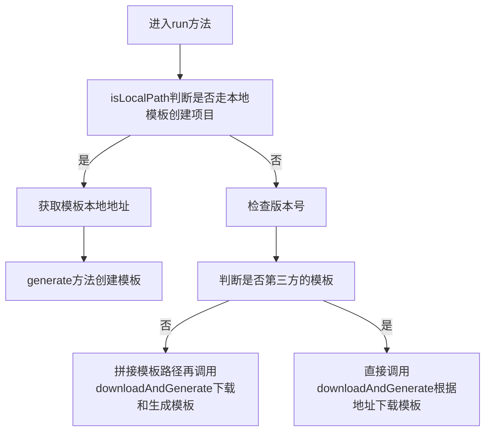
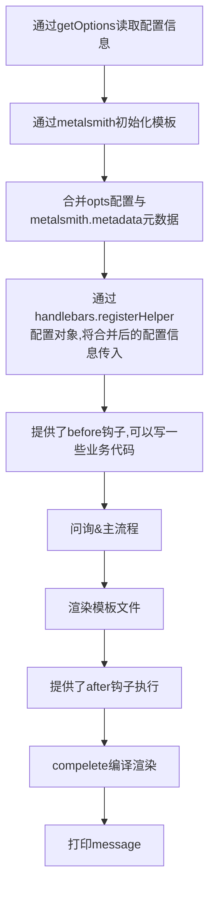

## Vue-cli

### 目录结构

主要脚本文件在bin目录里，里面包含了``vue``、``vue-build``、``vue-create``、``vue-init``、``vue-list``

### 执行顺序

首先进入``vue``脚本，会调用commander模块，该模块提供了用户执行脚本命令的功能，在vue文件定义了几个脚本语句，首先进行了版本检查，检查node版本与npm版本，然后提供了用户init、list、build、create，其中init与create作用一样，都是创建项目，但是create是v3版本的脚本

```js
program
  .version(require('../package').version)
  .usage('<command> [options]')
  .command('init', 'generate a new project from a template')
  .command('list', 'list available official templates')
  .command('build', 'prototype a new project')
  .command('create', '(for v3 warning only)')
```

### vue-init

vue-init使用commander提供了几个脚本和几个执行方法

- --c/--clone：该方法用于克隆git库项目
- --offline：使用缓存模板
- --help：打印了一些信息
- help()：如果命令行参数小于1的话打印help信息，提示用户完善脚本命令
- run()：主流程方法
- downloadAndGenerate()：下载和生成模板



#### downloadAndGenerate方法

下载的时候调用了spinner方法做了个加载效果，调用了download模块进行下载，最后还是通过generate方法创建模板

### 一些常用模块

- chalk：用于高亮提示

```js
#!/usr/bin/env node
// vue-build.js

const chalk = require('chalk')

console.log(chalk.yellow(
  '\n' +
  '  We are slimming down vue-cli to optimize the initial installation by ' +
  'removing the `vue build` command.\n' +
  '  Check out Poi (https://github.com/egoist/poi) which offers the same functionality!' +
  '\n'
))

```

- download-git-repo：下载远程仓库，用于下载模版代码
- commander：命令行处理工具，提供js执行命令行的能力
- inquirer：提供了询问流程(y/n)的提示
- metalsmith：静态网页生成
- handlebars：模版引擎
- consolidate：模版引擎解析渲染器

```js
const render = require('consolidate').handlebars.render
```


### 自定义的一些工具方法

- eval：因为原生的方法从安全性和性能方面都不太好，所以作者用Function自己写了个功能实现

```js
const chalk = require('chalk')

// 传入可执行函数
module.exports = function evaluate (exp, data) {
  /* eslint-disable no-new-func */
  const fn = new Function('data', 'with (data) { return ' + exp + '}')
  try {
    return fn(data)
  } catch (e) {
    console.error(chalk.red('Error when evaluating filter condition: ' + exp))
  }
}

```

- generate：创建模板



