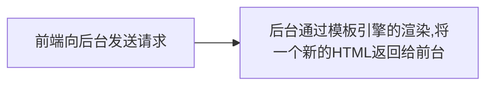

## vue-router

### 路由发展

路由的概念是伴随着SPA出现的，在此之前路由跳转是通过服务器端进行控制，比如jsp这些。



在SPA出现后，前端可以**自由的控制组件的渲染来模拟**页面的跳转

#### 总结

- 早期后端路由是根据``url``访问相关的``controller``进行数据资源和模板引擎的拼接，返回前端
- SPA的前端路由是通过`js`根据``url``返回对应的组件加载
  - ``url``的处理
  - 组件加载

### 路由的分类
- `history`路由
- `hash`路由
- `memory`路由 * 处理跨端时的路由
#### hash路由
`window.location.hash = "xx"`
#### history路由
`history./\(go|back|replace|push|forward)/`
通过直接操作url来实现跳转

#### 问题1：hash路由和history路由的区别
- hash路由一般会携带一个`#`号，不够美观。history路由不存在这个符号
- 默认hash路由是不会向浏览器发出请求，一般用于锚点，history中go/back/forward以及浏览器的前进后退按钮**一般**都会向服务端发起请求，history中的所有url内容服务端都能获取到
- 基于以上情况，hash模式不支持SSR，但是history模式可以做
- history在部署的时候，茹Nginx需要只渲染首页，让首页路径重新跳转要注意如何部署
```nginx
# 单个服务器部署
location / {
  try_files uri $uri /xxx/main/index.html
}
# 存在代理的情况
location / {
  rewrite ^ /file/index.html break; #代表的是xxx.cdn的资源路径
  proxy_pass https://www.xxx.cdn.com;
}
```

#### 问题2：history.go / back一定会刷新吗
- 要根据指定页面和当前页面的构建关系动态决定，当缓存不可用的时候就会刷新
#### 问题3：pushState会触发popState事件吗
popState是监听其他的操作
- pushState/replaceState都不会触发popState事件，需要触发页面的重新渲染才会触发
- popState什么时候触发
	- 点击浏览器的前进、后退按钮
	- back / foward / go

### Router异步组件
动态路由包括`React.lazy`、`import()`就是一种对代码进行动态拆分的技术，一般叫做`code splitting`。在需要的时候才进行加载，在webpack中可以使用chunksplit配合对路由import的时候添加前缀注释进行动态路由分割
```js
{
path: '/about',
name: 'About',
component: () => import(/* webpackChunkName: "about" */ '../views/About.vue')
}
```

### 路由守卫
**路由守卫的hook触发流程**，路由守卫是通过promise链式调用来同步执行流程调用对应的hook，核心方法是navigate
1. 【组件】- 前一个组件`beforeRouteLeave`
2. 【全局】- `router.beforeEach`
3. 【组件】- 如果是路由的参数变化，触发`beforeRouteUpdate`
4. 【配置文件】里，下一个路由的`beforeEnter`
5. 【组件】- 内部声明的`beforeRouteEnter`
6. 【全局】- 调用`beforeResolve`
7. 【全局】的`router.afterEach`
