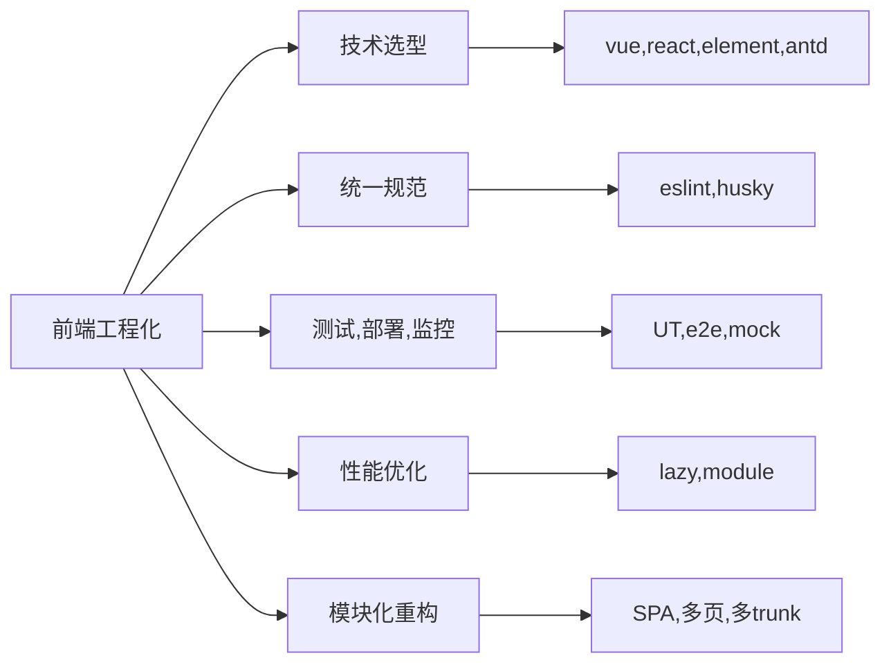

## 前端工程化

### 前端工程化

- 什么是工程化

前端从很久之前的静态页面到后面出现了jquery等js库都是用到原生，再后面的单页面应用比如用到vue、react则多了很多复杂的操作，比如打包，打包过程各种优化构建，eslint代码统一标准，性能优化等，这时候如果自己一点一点配置，每次都要花费大量时间，这时候就需要到工程化，可以理解成自动化，也就是将这一系列行为标准化。

- 为什么要工程化

简单来说，前端工程化可以提升开发体验、提高开发效率和质量、提升应用的访问性能，一切以提高效率、降低成本、质量保证为目的的手段都属于工程化

- 前端工程化与webpack

前端工程化不等同于Webpack，它主要包含从编码、发布到运维的整个前端研发生命周期，把软件工程相关的方法和思想应用到前端开发。



### webpack -- 静态文件打包工具

#### webpack组成及使用

##### 初始化webpack配置

- 手动搭建一个webpack项目一般需要``npm init``初始化出package.json，必须的依赖有webapck
- 初始化完下载了webpack就可以创建webpack.config.js文件，该文件暴露了一个jsno作为配置项
- 打包的时候运行命令行npx webpack就可以默认使用webpack.config.js
- 更多的可以看另一篇文章[手把手从0搭建webpack](https://github.com/Bill70058/webpack-note)

##### 运行流程与模块功能

假设目前在一个vue2.x项目中，webpack运行的流程是

1. 执行``npm run build``
2. 依赖 check-version会进行node版本与npm版本检查，看与依赖版本是否能匹配
3. 这里配置项分成两个，一个基本配置项，不包含业务需求的，在config文件夹下，有dev.env.js和prod.env.js。有包含业务需求的，基础的配置是webpack.base.conf.js，同时也分为运行环境webpack.dev.conf.js和生产环境webpack.dev.conf.js。基础配置项和本地与生产环境会通过一个叫``webpack-merge``的依赖将基础配置合并到其他环境的配置里

如果是纯webpack的话，其构建流程是：


在不同的阶段可以通过plugin的**tapable**提供的hooks(提供了不同的生命周期)将业务代码挂上去

[更多详细流程分析](https://mengsixing.github.io/blog/devops-webpack-entry.html#webpack-%E6%9E%84%E5%BB%BA%E6%B5%81%E7%A8%8B%E5%88%86%E6%9E%90)

#### 模块与面试题

- webpack + 整体模块化分析

##### webpack + 性能优化

- gzip压缩静态资源
- 压缩css文件
- loader配置优化
- 缓存，webpack5.x之前是通过cache-loader依赖，webpack5里有个cache属性自带持久化缓存
- 代码拆分，webpack有个属性叫**optimization**，里面有个splitChunks，设置chunks为all则自动拆分js代码

```json
optimization: {
    splitChunks: {
      chunks: 'all',
    }
}
```

- mode：通过不同的mode配置不同webpack业务依赖
- 多线程打包：happypack或者thread-loader

##### 微内核实际应用

微内核，有时也被称为插件化架构，一种面向功能进行拆分的可扩展性架构，通常用于实现基于产品的应用。看到这个描述就可以想到，这不就是和webpack的plugin一样的么

##### webpack：本地开发调用https接口

在vue2.x中，vue.config.js有个属性叫secure，设置为false则不校验https，vue3.x的该属性改名为https

webpack中该属性与vue2.x一样，叫secure，设置为false则不校验

如果是node本地开发要生成https的话可以本地生成csr证书

[参考链接](https://juejin.cn/post/6968722307275718663)

#### webpack相关再开发

更多展开文章[手把手写一个loader与plugin](https://juejin.cn/post/6976052326947618853/#heading-0)

##### loader

webpack 只能理解 JavaScript 和 JSON 文件，这是 webpack 开箱可用的自带能力。**loader **让 webpack 能够去处理其他类型的文件，并将它们转换为有效模块，以供应用程序使用，以及被添加到依赖图中

##### plugin

plugin 提供了很多比 loader 中更完备的功能，他使用阶段式的构建回调，webpack 给我们提供了非常多的 hooks 用来在构建的阶段让开发者自由的去引入自己的行为

### 函数式编程

##### 特点

1. Vue3 React16.8 全面化函数式的推动
2. 函数式编程可以使得代码单元相对更加独立 - tree shaking过程更顺畅，更方便做UT
3. 减少了对this的依赖，减轻了开发人员对于指向问题的困惑
4. js天生友好函数式：ramda、loadsh

##### 概念

- 简单说，"函数式编程"是一种["编程范式"](https://en.wikipedia.org/wiki/Programming_paradigm)（programming paradigm），也就是如何编写程序的方法论。
- 函数式的函数并非对于过程运算，函数的映射
- 幂等 - 相同的输入始终得到相同的输出


##### 高阶函数HOC

高阶函数的英文名叫Higher-order function。什么是高阶函数？高阶函数就是对其他函数进行操作的函数，它**接收函数作为参数**或**将函数作为返回值输出**。

###### 定义

1. 函数作为参数被传递到另一个函数中
2. 函数作为返回值被另外一个函数返回

```js
    let fn = arg => {
        let outer = "outer";
        let innerFn = () => {
            console.log(outer);
            console.log(arg);
        }
        return innerFn;
    }

    let closure = fn(18);
    // 闭包
```


##### 纯函数

```js
// 不纯的
let min = 18;
let limit = age => age > min;

// 纯的，没有外部变量，对外部没依赖
let limit = age => age > 18;
```


##### 柯里化

传递给函数一部分参数用于功能调用，让他返回一个函数去处理剩下的参数。总的来说就是用函数式编程对一个代码块做更细的拆分进行解耦。

```js
    let add = (x, y) => x + y;

    // 柯里化后
    let add = x => (y => x + y);

    let add2 = add(2);
    let add200 = add(200);

    add2(2); // 2 + 2 add(2)(2)
    add200(50); // 200 + 50

    // 回到上面的limit， 纯函数化
    let limit = min => (age => age > min);
    let limit18 = limit(18);
    limit18(20); // true
```


##### 函子

[函子](https://juejin.cn/post/6881967363747971086)是函数式编程的一个高阶概念，详情参考文章，这里就不进行赘述