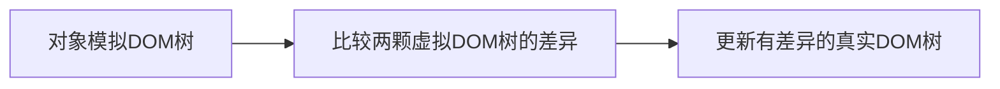
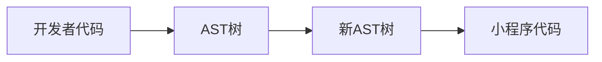
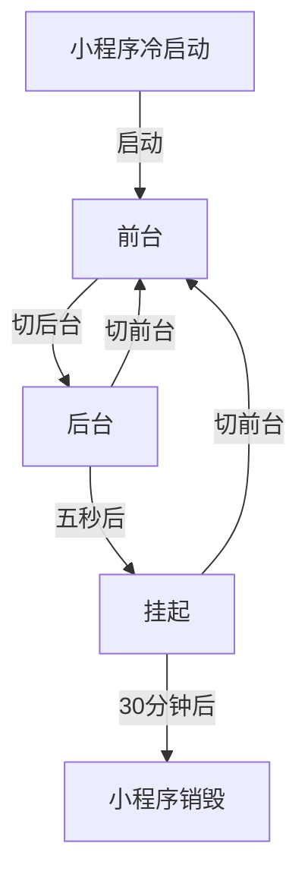

### 什么是小程序
> 小程序页面本质上是网页，使用了hybrid技术进行原生与web的混合开发，hybrid技术使用webview做渲染，通过`js bridge`作为web与native的数据交互桥梁

- 使用技术栈与网页开发是一致的，都用到HTML、CSS、JS
**区别**：不支持浏览器API，比如window、document，只能使用微信提供的API

### 微信小程序的发展历程
- 微信小程序形态
	- 小程序更像是公众号开发的升级
	- 早期微信通过sdk方式增强了开发者开发公众号网页的能力，小程序的诞生是微信迈向平台化超级app的业务行为，并且帮助用户更好的实现了「轻量级APP」
- 开发标准
	- 最初微信小程序自己定义了一套“标准”，最开始的框架没有组件、npm、和web生态严重脱节
	- 由于特殊的双线程模型与四不像语法，小程序开放只是对三方业务的开放
- 商家涌入
	- 小程序业务的开放性 -> 平台型app
	- 比如：支付宝小程序、百度、淘宝、360、快应用
	- 小程序设计的目的：大多数选择了和微信类似的架构，框架，更多不是从技术角度考虑，而是想尽可能蹭微信小程序的福利，让开发者更快的投放到自己的平台
### 微信小程序框架
[目录结构](https://developers.weixin.qq.com/miniprogram/dev/framework/structure.html)每个页面文件夹都包含了wxml、wxss、js、json几个后缀的文件，分别是模板文件，样式文件，js脚本文件，json页面配置文件。在目录最外层还有全局的app.js、app.json、app.wxss

### 小程序类型应用的技术选型
#### 渲染页面的技术方案
1. 用纯客户端原生技术渲染
2. 用纯web技术渲染
3. 用客户端原生技术与web技术结合的混合开发(hybrid)渲染
#### 方案对比
1. 开发门槛：web门槛低，原生也有像RN这样的框架支持
2. 体验：原生体验比web好太多，hybrid在一定程度上比web接近原生体验
3. 版本更新：web支持在线更新，如果小程序用原生开发，则需要打包到微信一起审核
4. 管控与安全：web可跳转或是改变页面内容，存在一些不可控因素和安全风险
#### 方案确定
- [x] 小程序的宿主环境是微信等手机app，用纯客户端原生技术来编写小程序，那么小程序代码每次都需要与手机app代码一起发版。所以该方案不可取
- [x]  web支持有一份副本资源包放在云端，通过下载到本地，动态执行后即可渲染出界面，但纯web技术在一些复杂的交互上可能有性能问题。所以该方案不可取
	- 在web技术中，UI渲染跟脚本执行都在一个单线程中执行，这就容易导致一些逻辑任务抢占UI渲染的资源
- [ ] 两者结合的hybrid技术来渲染小程序，用一种近似web的方式来开发，并且可以实现在线更新代码
	- 扩展web的能力，比如输入框组件(input、textarea)有更好的控制键盘的能力
	- 体验更好，同时减轻webview的渲染工作
	- 用客户端原生渲染内置一些复杂组件可以提供更好的性能

### 双线程模型
小程序的渲染层和逻辑层分为两个线程管理
- 视图层(Web View) -> WebView进行渲染
	- 界面渲染相关的任务都在WebView线程里执行，通过逻辑层代码区控制渲染哪些界面。一个小程序存在多个界面，所以视图层存在多个WebView线程
- 逻辑层(App Service) -> JsCore线程运行js脚本
	- 创建爱你一个单独的线程去执行js代码，在这里执行的都是有关小程序业务逻辑的代码，负责逻辑处理、数据请求、接口调用等
- JSBridge：上层开发与Native(系统层)的桥梁，使小程序可通过API使用原生的功能，且部分组件为原生组件实线，从而有良好体验
**设计目的**：为了管控和安全等问题，阻止开发者使用一些，例如浏览器的window对象，跳转页面，操作DOM、动态执行脚本的开放性接口

> 使用沙箱环境提供纯javascript的解释执行环境

1. 客户端系统，在pc运行时用javascript引擎执行js代码
2. ios：在ios系统时使用ios提供的Js core框架执行js代码
3. 安卓：在安卓系统时使用腾讯的x5内核提供的JsCore执行js代码

#### 数据驱动视图变化
> 问：js逻辑代码放到单独的线程中运行，在WebView线程无法直接操作DOM，开发者如何实现动态更改界面

DOM的更新通过简单的数据通信来实现，逻辑层和视图层的通信由native(微信客户端)做中转，逻辑层发送网络请求也经由native转发。

- 在渲染层把wxml转化为对应的js对象
- 在逻辑层发生数据变化的时候，通过宿主环境提供的setData方法把数据从逻辑层传递到native，再转发到渲染层
- 经过对比，更新真实dom内容
**总结**：这部分和mvvm框架类似，转化了ast树，通过native创建了虚拟dom，通过setData的方法更新数据，再通过native做了diff差异化更新真实dom树

#### 事件处理
> 微信做了特殊的处理，将所有的事件拦截后丢到逻辑层交给js处理

- 代码描述交互事件
- 视图层用户交互触发事件
- native拦截丢给逻辑层
- 逻辑层收到回调处理事件

事件的派发处理包括事件捕获和冒泡两种：
交互流程就如同上述的数据驱动视图变化一样，native拦截丢给逻辑层后，通过js响应事件，通过setData修改数据，虚拟dom发生变化，native diff更新真实dom

### 运行机制
- 冷启动：用户首次打开或者小程序被微信主动销毁后再次打开的情况(当手机系统五秒内两次以上内存告警，小程序会主动销毁)，此时小程序需要重新加载启动
- 热启动：加入用户已经打开过某小程序，在一定时间内(目前是五分钟)再次打开该小程序(小程序前后台切换)，此时无需重新启动
**注意**
- 小程序没有重启的概念

### 小程序框架对比
#### 小程序原生语法
- 目前小程序已经能够做到前端工程化，并且植入前端生态中已有的一些理念，比如状态管理，CLI工程化等等
- 前端能力基本在小程序上可以复用，比如状态管理，柯里化管理组件状态，ts等
#### 增强型框架
> 指小程序引入npm后，有了更开放的能力所带来的收益

以微信小程序为例，腾讯开源了[omi](https://github.com/Tencent/omi/blob/master/README.CN.md)框架
- 整体保留了小程序现有语法，在此之上对它进行了扩充和增强
- 比如引入了computed hook，比如能直接通过`this.store.data.logs[0] = 'changed'`修改状态，彻底将微信小程序vue化

#### 转换型框架
能够**一码多端**的框架，比如rax、taro、uniapp，让开发者几乎不用感受小程序原生语法，更大程度对接前端已有生态，只是最后构建产物为小程序代码
这些框架实际都是通过转换产物1:1转换成对应的小程序代码

##### 编译时
**优势**
- 运行时性能损耗低
- 目标代码明确，开发者所写即所得
- 运行时、编译时优化：比如框架会给予开发者更多的语法支持以及默认的性能优化处理，比如避免多次setData，或者长链表优化等等
**劣势**
- 语法限制高：需要完全命中开发者在模板部分所用到的所有语法，语法受限，由于是1:1编译转换，开发者在开发的时候还是不得不去遵循小程序的开发规范，比如一个文件只能定义一个组件之类的
##### 运行时
比起编译时，最大优势是可以几乎没有任何语法约束的去完成代码编写
优势：没有语法限制

### 微信小程序
#### 文档必读
推荐将文档的指南、框架、组件、API、工具相关的通读一遍
#### 基本内容
示例代码github地址：[https://github.com/wechat-miniprogram/miniprogram-demo](https://github.com/wechat-miniprogram/miniprogram-demo)
#### 基础
官方文档：[https://developers.weixin.qq.com/miniprogram/dev/framework/](https://developers.weixin.qq.com/miniprogram/dev/framework/)
#### 基础核心

- 更新机制
	- 启动时同步更新
		- 定期检查小程序版本
		- 长时间未使用小程序
	- 启动时异步更新
		- 打开发现有新版本，异步下载，下次冷启动时加载新版本
	- 开发者手动更新
		- [wx.getUpdateManager](https://developers.weixin.qq.com/miniprogram/dev/api/base/update/wx.getUpdateManager.html)
- 代码注入
	- 按需注入：“lazyCodeLoading”：“requiredComponents”配置路径进行打包
	- 用时注入：在开启「按需注入」特性的前提下，指定一部分自定义组件不在小程序启动时注入，而是在真正渲染的时候才进行注入，使用占位组件在需要渲染但注入完成前展示
- 分包加载
	- 原则
		- 声明subpackages后，将俺subpackages配置路径进行打包，subpackages配置路径外的目录将被打爆到app(主包)中
		- app(主包)也可以有自己的pages(即最外层的pages字段)
		- subpackage的根目录不能是另外一个subpackage内的子目录
		- tabBar页面必须在app(主包)内
	- 独立分包
		- 当小程序从普通的分包页面启动时，需要受限下载主包
		- 独立分包运行时，App并不一定被注册，因此getApp()也不一定可以获得App对象。基础库[2.2.4](https://developers.weixin.qq.com/miniprogram/dev/framework/compatibility.html)版本开始getApp支持`[allowDefault]`参数，在App未定义时返回一个默认实现，当主包加载，App被注册时，默认实现中定义的属性会被覆盖合并到真正的App中
- 调试小程序
	- 使用[vconsole](https://www.npmjs.com/package/vconsole)
	- 开启[sourceMap](https://developers.weixin.qq.com/miniprogram/dev/devtools/sourcemap.html)配置项
	- 实时日志：重写log，使用wx.getRealtimeLogManager封装，在运营后台“开发->开发管理->运维中心->实时日志"查看
	- errno：开发者自己抛出异常，针对API的cb err进行状态码的判断，针对业务场景语义化展示
#### 如何兼容版本
##### 版本号比较
```js
const version = wx.getSystemInfoSync().SKDVersion
if (compareVersion(version, '1.1.0') >= 0) {
  wx.openBluetoothAdapter()
} else {
  wx.showModal({
    title: '提示',
    content: '当前微信版本过低，无法使用该功能，请升级到最新微信版本后重试'
  })
}
```
##### 判断API是否存在
```js
if (wx.openBluetoothAdapter) {
  wx.openBluetoothAdater()
} else {
  wx.showModal({
    title: '提示',
    content: '当前微信版本过低，无法使用该功能，请升级到最新微信版本后重试'
  })
}
```

##### wx.canIUse
判断当前环境是否能使用api，和jsdk的api权限判断类似
```js
wx.showModal({
success: function(res) {
  if (wx.canIUse('showModal.success.cancel')) {
    console.log(res.cancel)
  }
}
})
```
##### 最低基础库版本
运营后台设置最低基础库版本

### 框架
微信原生小程序框架[官方文档](https://developers.weixin.qq.com/miniprogram/dev/reference/)
- 小程序配置
	- 全局配置
	- 页面配置
	- sitemap配置
- 框架接口
	- App：必须在app.js中调用且只能调用一次
		- 一些全局的生命周期
	- getApp：外部访问App中数据的方式
- 页面
	- Page
		- data
		- 一些页面中的生命周期
	- getCurrentPages：获取当前页面栈，可以获取当前页面信息，比如路由，也可以通过该方法实现跨页面赋值
```js
// 跨页面赋值
let pages = getCurrentPages() // 当前页面栈
let prePage = pages[pages.length - 2] // 上一页面
prevPage.setData({
// 直接给上一页面复制
})
// 页面跳转后自动刷新
wx.switchTab({
   url: '../index/index',
   success: function (e) {
     const page = getCurrentPages().pop(); // 当前页面
     if (page == undefined || page == null) return;
     page.onLoad(); //或者其他操作
} })
```
- Router
	- 页面路由器有 `switchTab` `reLaunch` `redirectTo` `navigateTo` `navigateBack` 五个方法
	- 与 wx 对象向同名的五个方法 [`switchTab`](https://developers.weixin.qq.com/miniprogram/dev/api/route/wx.switchTab.html) [`reLaunch`](https://developers.weixin.qq.com/miniprogram/dev/api/route/wx.reLaunch.html) [`redirectTo`](https://developers.weixin.qq.com/miniprogram/dev/api/route/wx.redirectTo.html) [`navigateTo`](https://developers.weixin.qq.com/miniprogram/dev/api/route/wx.navigateTo.html) [`navigateBack`](https://developers.weixin.qq.com/miniprogram/dev/api/route/wx.navigateBack.html) 功能相同；唯一的区别是，页面路由器中的方法调用时，相对路径永远相对于 `this` 指代的页面或自定义组件。
```js
Page({
  wxNavAction: function () {
    wx.navigateTo({
      url: './new-page'
    })
  },
  routerNavAction: function () {
    this.pageRouter.navigateTo({
      url: './new-page'
    })
  }
})
```
### 自定义组件
- [Component](https://developers.weixin.qq.com/miniprogram/dev/reference/api/Component.html)：在微信开发工具右键新建组件自动创建了自定义组件模板，整体包裹在一个Component对象下
- [Behavior](https://developers.weixin.qq.com/miniprogram/dev/reference/api/Behavior.html)：behaviors是用于组件间代码共享的特性, 类似一些编程语言中的'mixin'或者'traits'，它可以将behavior模块的代码混入组件代码中，一般是抽离出逻辑代码和部分属性

```js
// 官方示例
module.exports = Behavior({
  behaviors: [],
  properties: {
    myBehaviorProperty: {
      type: String
    }
  },
  data: {
    myBehaviorData: {}
  },
  attached: function(){},
  methods: {
    myBehaviorMethod: function(){}
  }
})
```

基础用法，先新建一个组件，再通过组件自带的behaviors属性混入behavior模块，这个属性类似vue的mixins
```js
// 新建个组件
<view>属性: {{myBehaviorProperty}} --- {{myCompProperty}}</view>
<view>数据: {{myBehaviorData}} --- {{myCompData}}</view>
<view bind:tap="myBehaviorMethod">触发behavior的自定义方法</view>
<view bind:tap="myCompMethod">触发组件的自定义方法</view>

// 组件级js
import testBehavior from './testBehavior'
Component({
  behaviors: [testBehavior],
  properties: {
    myCompProperty: {
      type: String,
      value: ''
    }
  },
  data: {
    myCompData: 'myCompData'
  },
  created: function (){
    console.log('[my-component]- created')
  },
  attached: function (){
    console.log('[my-component]- attached')
  },
  ready: function (){
    console.log('[my-component]- ready')
  },
  methods: {
    myCompMethod: function () {
      console.log('[my-component]- method')
    }
  }
})
```

```js
// behavior.js
export default Behavior({
  behaviors: [],
  properties: {
    myBehaviorProperty: {
      type: String,
      value:  'myBehaviorProperty'
    }
  },
  data: {
    myBehaviorData: 'myBehaviorData'
  },
  created: function () {
    console.log('[my-behavior]- created')
  },
  attached: function () {
    console.log('[my-behavior]- attached')
  },
  ready: function () {
    console.log('[my-behavior]- ready')
  },
  methods: {
    myBehaviorMethod: function () {
      console.log('[my-behavior]- method')
    }
  }
})
```
### 面试会问到的
#### 为什么要分包
目前小程序主包有限制大小不能超过2M，整体(包括分包)不能超过20M，对小程序分包可以优化首次启动的下载时间，以及在多团队共同开发时可以更好的解耦
#### 页面通信 -- 组件高阶用法
- 跨页面赋值
	- 类似vue中的ref，直接操控组件的属性值
```js
let pages = getCurrentPages() // 当前页面栈
let prePage = pages[pages.length - 2] // 上一页面
prevPage.setData({
// 直接给上一页面复制
})
```
- 使用behavior进行数据共享
- 使用`wx.nativgateTo`打开，这两个页面将建立一条数据通道，类似父子组件，可以通过`emit`和`on`互相发送
	- 被打开的页面可以通过`this.getOpenerEventChannel()`方法来获取一个`EventChannel`对象
	- `wx.navigateTo`的`success`回调中也包含一个`EventChannel`对象
	- 这两个`EventChannel`对象间可以使用`emit`和`on`方法互相发送、监听事件
#### seo优化
小程序如何seo优化[官方文档](https://developers.weixin.qq.com/miniprogram/dev/framework/search/seo.html)
- 配置小程序sitemap
- 小程序里跳转的页面(url)可被直接打开
- 页面跳转优先采用navigate组件
- 必要的时候才请求用户进行授权、登录、绑定手机号登
	- 开发中遇到过如果要通过企微群发公众号页面时，企微爬取不到页面信息，因为页面使用了静默授权，爬取页面的时候直接跳转到授权页了，所以获取不到页面信息
- 设置一个清晰的标题和页面缩略图
#### 性能相关
- 小程序启动流程[官方文档](https://developers.weixin.qq.com/miniprogram/dev/framework/performance/tips/start_process.html)
- 小程序切换页面流程[官方文档](https://developers.weixin.qq.com/miniprogram/dev/framework/performance/tips/runtime_nav.html)
- 如何提升小程序性能
	- 启动时性能优化
		- [代码包体积优化(分包)](https://developers.weixin.qq.com/miniprogram/dev/framework/performance/tips/start_optimizeA.html)
		- [代码注入优化(懒加载模块)](https://developers.weixin.qq.com/miniprogram/dev/framework/performance/tips/start_optimizeB.html)
		- [首屏渲染优化](https://developers.weixin.qq.com/miniprogram/dev/framework/performance/tips/start_optimizeC.html)
		- [其他优化](https://developers.weixin.qq.com/miniprogram/dev/framework/performance/tips/start_optimizeD.html)
	- 运行时性能优化
		- [合理使用setState](https://developers.weixin.qq.com/miniprogram/dev/framework/performance/tips/runtime_setData.html)
		- [渲染性能优化](https://developers.weixin.qq.com/miniprogram/dev/framework/performance/tips/runtime_render.html):非必要不监听滚动事件，尽量少用复杂动画效果
		- [页面切换优化](https://developers.weixin.qq.com/miniprogram/dev/framework/performance/tips/runtime_nav.html)：避免在onHide/onUnload执行耗时操作，提前发起数据请求
		- [资源加载优化](https://developers.weixin.qq.com/miniprogram/dev/framework/performance/tips/runtime_resource.html)：图片资源控制
		- [内存优化](https://developers.weixin.qq.com/miniprogram/dev/framework/performance/tips/runtime_memory.html)：分包、按需注入，内存分析，处理内存告警
			- 内存泄漏：如果页面示例被挂载到全局或者其他地方还有使用到，那么该页面this得不到释放，容易造成内存泄漏，当需要其他页面用到该this时，在该页面unload时需要处理手动释放内存
#### 如何进行埋点
- 手动设置自己的埋点系统(需要埋点量少的时候)
- 如果是vue、react等框架则可以在webpack中加载自己写的babel插件，在转化ast这步自动插入埋点
- 小程序中可以用腾讯官方提供的埋点工具，也可以通过开发者工具[自定义分析](https://developers.weixin.qq.com/miniprogram/analysis/wedata/BusinessAnalysisAccess.html#_1-1%E4%BA%8B%E4%BB%B6%E5%88%86%E7%B1%BB)设置埋点上报