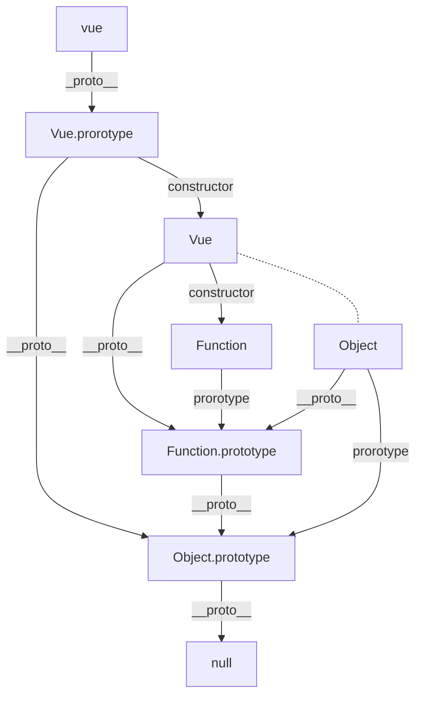

## 面相对象/原型链

### 什么是面向对象

面向对象是一种编程思维，将可以简单理解为代码以业务进行模块划分，逻辑迁移更加灵活、代码复用性高、高度的模块化

### 对象的理解

* 对象是对于单个物体的简单抽象
* 对象是一个容器，封装了属性 & 方法
  *  属性：对象的状态
  *  方法：对象的行为

```js
    // 简单对象
    const Vue = {
        a: 'aaa',
        b: 'bbb',
        startCourse: function(name) {
            return `this name is:${name}`;
        }
    }

    // 函数对象
    function Vue() {
        this.a = '云隐';
        this.b = '小可';
        this.startName = function(name) {
            return `this name is:${name}`;
        }
    }
```

### 构造函数

- 用于生成对象，需要一个模板 - 表征了一类物体的共同特征， 从而生成对象

- 类即对象模板

- js其实本质上并不是基于类，而是基于构造函数 + 原型链

- constructor + prototype

```js
    function Vue(a) {
        this.a = a;
        this.b = 'bbb';
        this.startName = function(name) {
            return `this name is:${name}`;
        }
    }
    const vue = new Vue('name');
```

### Vue本质就是构造函数

* 函数体内使用的this，指向所要生成的实例 -- vue
* 生成对象用new来进行实例化
* 可以做初始化传参

- 如果构造函数不初始化， 无法使用

#### 如果项目中需要使用，通常（不被外界感知）如何解决

比如在写一个工具类，不需要外部new，不需要外部做一些额外的操作，内部做好了处理，兼容用户的一些奇怪写法使用方式

**如果编写底层的api代码时，尽量做到不需要让外部感知内部类型**

```js
    function Vue() {
      // 如果没有实例化则返回一个实例化给用户，不再需要用户多一步new的操作
        const _isClass = this instanceof Vue;
        if (!_isClass) {
            return new Vue();
        }

        this.a = 'aa';
        this.b = 'bb';
        this.startName = function(name) {
             return `this name is:${name}`;
        }
    }
    // 使用方
    const vue = Vue();
```

####  new是什么 / new的原理 / new时候做了些什么

```js
function Vue() {}
const vue = new Vue()
```

* 1. 创建了一个空对象，作为返回的对象实例
* 2. 将生成空对象的原型对象指向了构造函数的prototype属性
* 3. 将当前实例对象赋给了内部this
* 4. 执行构造函数的初始化代码

#### 实例属性影响 - 独立

通过new创建的实例每一个都是独立的存在，其内部属性及方法修改都不会影响到其它的实例，可以理解为都是经过深拷贝的

```js
    function Vue(a, b) {
        this.a = a;
        this.b = b;
    }
    const vue1 = new Vue('a', 'b');
    const vue2 = new Vue('a', 'bb');

    vue2.b = 'bbb'; // 不影响其他实例
```

#### constructor 是什么？

```js
function Vue(a, b) {
    this.a = a;
    this.a = b;
}
const vue = new Vue('aa', 'bb');
```
* 1. 每个对象在创建时，会自动拥有一个构造函数属性constructor
* 2. constructor继承自原型对象，指向了构造函数的引用

#### 使用构造函数 没有问题么 / 会有什么性能上的问题?

构造函数中的方法，会存在于每一个生成的实例里，重复的挂载其实是会导致资源浪费

```js
    function Vue() {
        this.a = 'aa';
        this.b = 'bb';
        this.startName = function(name) {
             return `this name is:${name}`;
        }
    }
    // 使用方
    const vue1 = Vue('name1');
    const vue2 = Vue('name2');
```
#### 原型对象

```js
function Vue(){}
const vue1 = new Vue()
const vue2 = new Vue()
```

* 构造函数： 用来初始化创建对象的函数 - Vue 
  * 自动给构造函数赋予一个属性prototype，该属性等于实例对象的原型对象
* 实例对象：vue1是实例对象，根据原型对象创建出来的实例
  * 每个对象中都有一个``__proto__``
  *  每个实例对象都有一个constructor
  *  constructor有继承而来，并指向当前的构造函数
* 原型对象：Vue.prototype

```js
    function Vue() {};
    Vue.prototype.a = 'aa';
    const vue1 = new Vue();
    const vue2 = new Vue();

    // 对面原型对象做优化
    function Vue() {
        this.a = 'aaa';
        this.b = 'bbb';
    }
    
    // 方法挂载于prototype上
// 通过这种方法，既可以拿到实例上的所有公共属性，又可以拿到原型链上的方法，且不会每个实例都挂载一次，优化了冗余
    Course.prototype.startName = function(name) {
        return `this name is:${name}`
    }

    const vue1 = new Vue('es6');
    const vue2 = new Vue('OOP');
```

### 继承 -- 原型链继承

**在原型对象的所有属性和方法，都能被实例所共享**

> 本质：重写原型对象方式，将父对象的属性方法，作为子对象原型对象的属性和方法

```js
// Game类
function Game() {
    this.name = 'lol'
}
Game.prototype.getName = function() {
    return this.name;
}
// LOL类
function LOL() {}
LOL.prototype = new Game();
LOL.prototype.constructor = LOL; // 构造器指向自身的构造函数
const game = new LOL()
```
这里Game作为LOL类的父类，LOL原型本来指向自身实例，由于要继承，用父类实例覆盖自身实例，这样就能继承到父类的方法及属性。但是构造器一直是指向自身构造函数的，所以用父类实例覆盖了原型链之后还要将自身的构造函数覆盖回原型链上

#### 原型链继承有什么缺点

* 1. 父类属性一旦赋值给子类的原型属性，此时属性属于子类的共享属性了
* 2. 实例化子类时，无法向父类做传参

```js
    function Game() {
        this.name = 'lol';
        this.skin = ['s'];
    }
    Game.prototype.getName = function() {
        return this.name;
    }

    // LOL类
    function LOL() {}
    LOL.prototype = new Game();
    LOL.prototype.constructor = LOL;
    const game1 = new LOL();
    const game2 = new LOL();
    game1.skin.push('ss');
		console.log(game2.skin) // ['s', 'ss']，这里每个实例的方法及操作的属性值都是一样的，失去了示例自身的独立性，可以理解为从深拷贝变成了浅拷贝
```

因为getName方法是通过原型链的方式挂载的，所以所有实例都能共享到这一个方法和里面数据的变化，实例之间不再是独立的了

#### 解决方法：构造函数继承

**经典继承：在子类构造函数内部调用父类构造函数**

> 解决了共享属性的问题 + 子向父传参问题。通过该方式继承后的属性不再通用，每个实例属性都恢复自身独立性

```js
    function Game(arg) {
        this.name = 'lol';
        this.skin = ['s'];
    }
    Game.prototype.getName = function() {
        return this.name;
    }

    // LOL类
    function LOL(arg) {
        Game.call(this, arg);
    }

    const game1 = new LOL('aa');
		const game2 = new LOL('bb')
```

#### 原型链上的共享方法无法被读取继承，如何解决？

**解决方案：组合继承**

```js
    function Game(arg) {
        this.name = 'lol';
        this.skin = ['s'];
    }
    Game.prototype.getName = function() {
        return this.name;
    }

    // LOL类
    function LOL(arg) {
        Game.call(this, arg);
    }
    LOL.prototype = new Game();
    LOL.prototype.constructor = LOL;

    const game1 = new LOL();
```

##### 组合式继承的缺点：

无论何种场景，都会调用两次父类构造函数

* 1. 初始化子类原型时
* 2. 子类调用函数内部call父类的时候

#### 寄生组合继承

原本的原型链继承是直接浅拷贝，这里就使用了深拷贝，每一个实例都恢复了自己的独立性

```js
function Game(arg) {
    this.name = 'lol';
    this.skin = ['s'];
}
Game.prototype.getName = function() {
    return this.name;
}

// LOL类
function LOL(arg) {
    Game.call(this, arg);
}
LOL.prototype = Object.create(Game.prototype);
LOL.prototype.constructor = LOL;
```
#### 实现多重继承

```js
    function Game(arg) {
        this.name = 'lol';
        this.skin = ['s'];
    }
    Game.prototype.getName = function() {
        return this.name;
    }

    function Store() {
        this.shop = 'steam';
    }
    Store.prototype.getPlatform = function() {
        return this.shop;
    }

    function LOL(arg) {
        Game.call(this, arg);
        Store.call(this, arg);
    }
		// LOL的原型链被Game的覆盖掉了，再通过合并“LOL”与Store的原型链实线合并两个原型链属性的效果
    LOL.prototype = Object.create(Game.prototype);
    Object.assign(LOL.prototype, Store.prototype);
// 可以直接写成一行LOL.prototype = Object.assign(Object.create(Game.prototype), Store.prototype)
    LOL.prototype.constructor = LOL;
    // LOL继承两类
    const game3 = new LOL();
```

### 总结：

- 普通的继承 -- 原型链继承，通过将父类的实例覆盖子类实例实现
  - 缺点：父类属性一旦赋值给子类的原型属性，此时属性属于子类的共享属性了
  - 实例化子类时，无法向父类做传参
- 构造函数继承，通过在子类调用父类构造函数实线继承父类的属性，在calss中用super实现
  - 缺点：原型链上的共享方法无法被读取继承
- 组合继承，原型链继承 + 构造函数继承，解决了属性的独立性和原型链方法的继承
  - 缺点：无论何种场景，都会调用两次父类构造函数
- 寄生组合继承，通过将原型链深拷贝来继承，原型链上的方法因此获得了独立性


### 原型链图示



大致可以按照这个图来推导，详细的可以参考[Javascript深入之从原型到原型链](https://github.com/mqyqingfeng/Blog/issues/2)，从当前这个图可以看出来一个实例溯源到null的一个关系流程图，之间是有个相互的关系